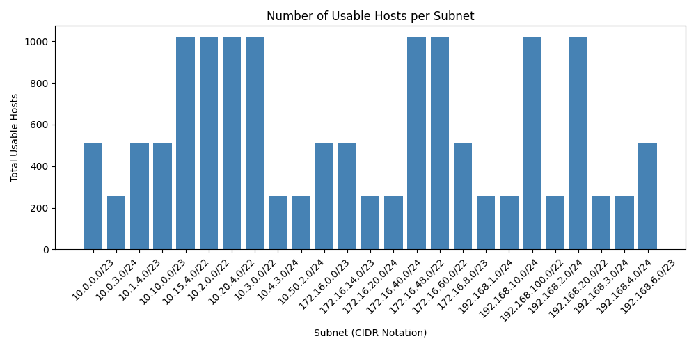

# 🧠 Subnet Analyzer & Visualizer (Dockerized)

This project analyzes a list of IP addresses and subnet masks from an Excel file and generates:
- A full subnet report
- A grouped summary by CIDR
- A visual bar chart of usable hosts per subnet

Built for a DevOps internship task using Python and Docker.

Features:
- Reads IP addresses and subnet masks from ip_data.xlsx
- Calculates:
  - CIDR notation
  - Network address
  - Broadcast address
  - Usable hosts
- Groups usable hosts by subnet
- Generates:
  - subnet_report.csv
  - grouped_hosts.csv
  - network_plot.png
- Fully Dockerized — no setup needed on your machine

Technologies Used:
- Python 3
- Pandas
- Matplotlib
- OpenPyXL
- Docker

Project Structure:
barq-devops-task/
├── ip_data.xlsx               # Input IPs and subnet masks
├── subnet_analyzer.py         # Python script for subnet calculations
├── visualize.py               # Python script for generating bar chart
├── Dockerfile                 # Docker build instructions
├── README.md                  # This file
├── report.md                  # Analysis questions and answers
├── output/                    # Auto-generated reports
│   ├── subnet_report.csv
│   ├── grouped_hosts.csv
│   └── network_plot.png

How to Run the Project with Docker:
1. Open a terminal in the project folder (Example for Windows: cd C:\Users\user\Downloads\barq-devops-task)
2. Build the Docker image:
   docker build -t subnet-analyzer .
3. Run the Docker container and mount your output folder:
   docker run -v ${PWD}/output:/app/output subnet-analyzer

This will:
- Read from ip_data.xlsx
- Generate subnet_report.csv, grouped_hosts.csv, and network_plot.png
- Save all files to your local output/ folder

Output Files:
output/
├── subnet_report.csv       # Full breakdown of each IP
├── grouped_hosts.csv       # Total usable hosts by subnet
└── network_plot.png        # Visual bar chart of host distribution

How to Run Without Docker (Locally):
1. Install the required libraries:
   pip install pandas matplotlib openpyxl
2. Run the scripts:
   python subnet_analyzer.py
   python visualize.py

This will also save the output files in the output/ folder.

Author:
Hossam Khalid  
GitHub: https://github.com/Alhoss77  
Email: hoss6176@gmail.com

Part of a DevOps internship project for automated subnet analysis and visualization using Python and Docker.
